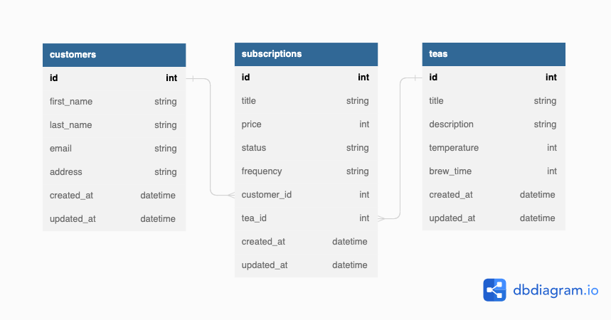

<div align="center">
  <h1>Tea for One</h1>
  <div align="center"></div>
</div>
<br>

Tea for One is a Rails API application for a fictional tea subscription service, based on the [requirements and specifications](https://mod4.turing.edu/projects/take_home/take_home_be) provided by the [Turing School of Software and Design](https://turing.edu/).
<br>

The purpose of this project is to simulate a take-home techincal challenge provided by a potential employer, where the project is meant to be completed within an eight-hour time box.
<br>
<br>

# Table of Contents
- [Planning and Design](#planning-and-design)
- [Tech & Tools Used](#tech-and-tools)
- [How to Set Up](#how-to-set-up)
- [How to Run Test Suite](#how-to-run-test-suite)
- [Available Endpoints](#available-endpoints)
- [Contributors](#contributors)
<br>
    
# Planning and Design



<br>

*Design Decisions:*
* Subscriptions table - `price`: Integer in pennies, `status`: String as either `active` or `cancelled`
* Teas table - `temperature`: Integer in Fahrenheit, `brew_time`: Integer in minutes

# Tech and Tools
### Built With
  -  **2.7.4**
  -  **5.2.8.1**
  -  **3.12.0**
  - 
  - 

### Gems Used:
  - [JSON:API-Serializer](https://github.com/jsonapi-serializer/jsonapi-serializer)
  - [Pry](https://github.com/pry/pry-rails)
  - [Simple-Cov](https://github.com/simplecov-ruby/simplecov)
  - [Shoulda Matchers](https://github.com/thoughtbot/shoulda-matchers)
  - [Factory Bot Rails](https://github.com/thoughtbot/factory_bot_rails)
  - [Faker](https://github.com/faker-ruby/faker)
<br>

# Developer Setup
<ol>
  <li>Fork this repository</li>
  <li>Clone your fork</li>
  <li>cd into the root directory</li>
  <li>From the command line, run <code>bundle install</code></li>
  <li>Then run <code>rails db:{create,migrate}</code></li>
  <li>To run this server, run <code>rails s</code> in your terminal</li>
  <li>To stop the local server, use command <code>Control + c</code></li>
</ol>
<br>

# How to Run Test Suite
  After setup:
  <ul>
    <li>Run <code>bundle exec rspec spec</code></li>
    <li>Run <code>open coverage/index.html</code> to view testing coverage in your browser</li>
  </ul>
<br>

# Available Endpoints
<details close>
<summary>Get All Subscriptions for a Customer</summary>
<br>

Returns all subscriptions for a given customer, both active and cancelled status
<br>

Request: <br>
```
GET /api/v1/customers/1/subscriptions
```

Sample JSON Response: <br>
```json
{
    "data": [
        {
            "id": "2",
            "type": "subscription",
            "attributes": {
                "title": "Silver Plan",
                "price": 1500,
                "status": "active",
                "frequency": "monthly",
                "customer_id": 1,
                "tea_id": 3
            }
        },
        {
            "id": "2",
            "type": "subscription",
            "attributes": {
                "title": "Platinum Plan",
                "price": 3500,
                "status": "cancelled",
                "frequency": "weekly",
                "customer_id": 1,
                "tea_id": 2
            }
        },
        {...},
    ]
}
```
  
</details>

<details close>
<summary>Create a Subscription for a Customer</summary><br>
Creates a subscription for a customer with a specific tea

Request: <br>
```
POST /api/v1/customers/1/subscriptions
```

JSON Request Body: <br>
```json
{
    "title": "Gold Plan",
    "price": 2500,
    "status": "active",
    "frequency": "bi-weekly",
    "customer_id": "1",
    "tea_id": 4
}
```

Sample JSON Response: <br>
```json
{
    "data": "Subscription added successfully!"
}
```

</details>

<details close>
<summary>Cancel a Customer's Subscription</summary><br>
Cancels a subscription by updating the status from active to cancelled

Request: <br>
```
PATCH /api/v1/customers/1/subscriptions/2
```

JSON Request Body: <br>
```json
{
    "title": "Platinum Plan",
    "price": 3500,
    "status": "cancelled",
    "frequency": "weekly",
    "customer_id": 1,
    "tea_id": 2
}
```

Sample JSON Response: <br>
```json
{
    "data": {
        "id": "2",
        "type": "subscription",
        "attributes": {
            "title": "Platinum Plan",
            "price": 3500,
            "status": "cancelled",
            "frequency": "weekly",
            "customer_id": 1,
            "tea_id": 2
        }
    }
}
```
</details>

<br>

# Contributors

<table>
  <tr>
    <td></td>
  </tr>
  <tr>
    <td>
    <div align="center"><strong>Gabe Nuñez</strong></td></div>
  </tr>
  <tr>
    <td>
      <div align="center"><a href="https://github.com/gabrielcnunez">GitHub</a><br>
      <a href="https://www.linkedin.com/in/gabriel-nunez-az/">LinkedIn</a></div>
    </td>
  </tr>
</table>

<p align="right">(<a href="#top">back to top</a>)</p>
